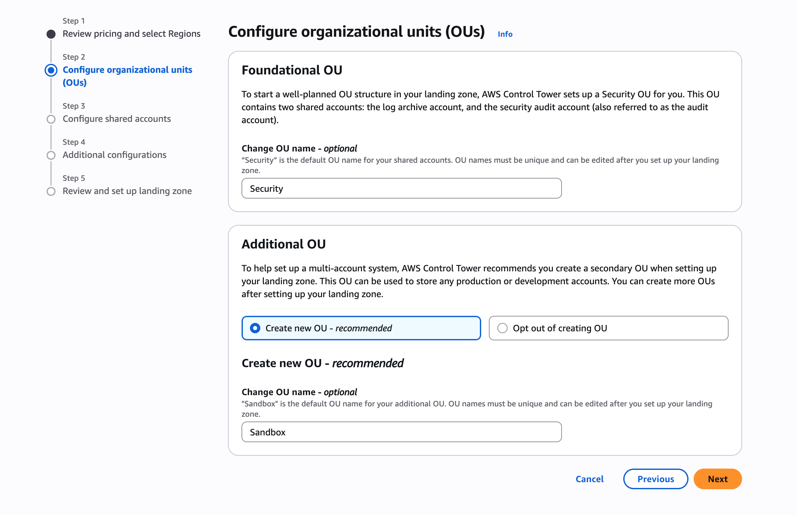
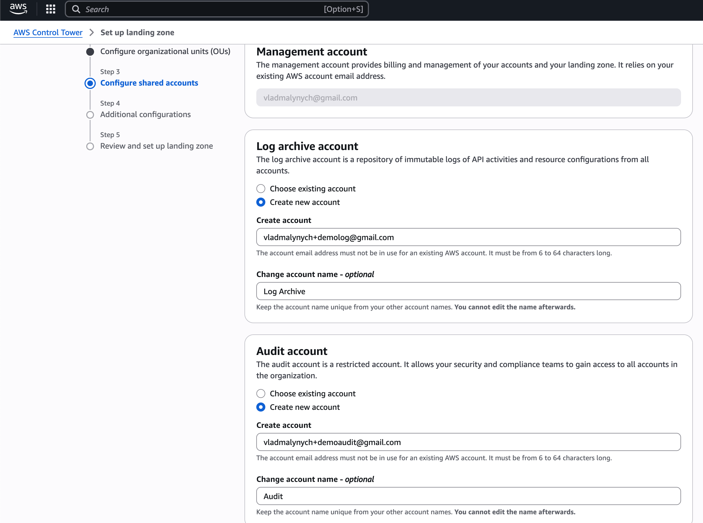
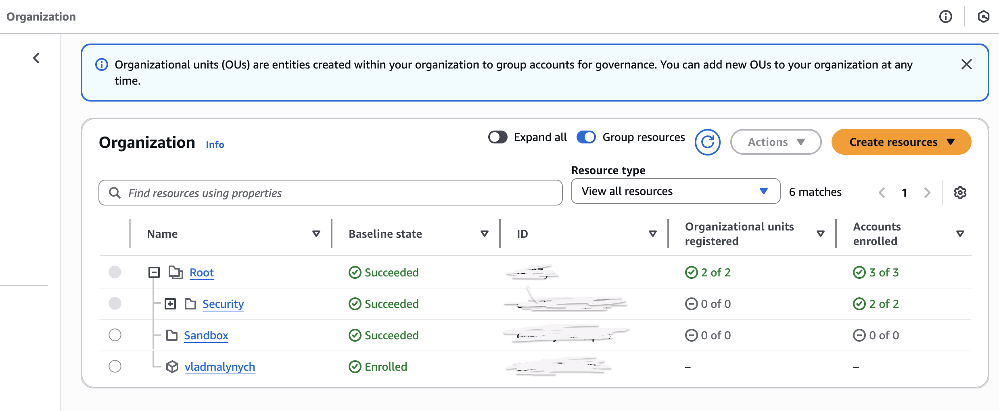

# AWS Control Tower Demo & Overview

## What is AWS Control Tower?

**AWS Control Tower** is a service that helps set up and govern a secure, multi-account AWS environment based on AWS best practices. It automates the setup of a landing zone and provides governance using **guardrails**, **account provisioning**, and **centralized logging**.

This guide provides a step-by-step walkthrough to set up AWS Control Tower via the AWS Console and compares it to manually managing AWS accounts.

---

## 🚀 Setting Up AWS Control Tower (Console-based Walkthrough)

### Prerequisites

* An AWS Organization with all features enabled
* Root account access or sufficient IAM privileges
* Region support (Control Tower is not available in all regions — start in `us-east-1` or `eu-west-1`)

### Step 1: Review Pricing and Select Regions

1. Sign in to the AWS Management Console using the root account.
2. Navigate to **Control Tower** from the Services menu or search bar.
3. Click **Set up landing zone**.
4. Review pricing information.
5. Choose your preferred **governed AWS regions** (e.g., us-east-1, eu-west-1).

### Step 2: Configure Organizational Units (OUs)

1. Create Foundational OU (default name `Security`).
2. Create Additional OUs if needed (e.g., `Enviroments`, this can be created later).

### Step 3: Configure shared accounts

1. Configure Log Archive account. (immutable logs of API activities and resource changes from all accounts.)
2. Configure Audit account. (centralized account for security and compliance audits.)

Note: These accounts are created automatically and used for centralized logging and governance under Security OU.

### Step 4: Additional Configurations

1. Choose an **SSO option** or AWS IAM Identity Center configuration. 
2. Configure trail and config settings for centralized logging. 
3. Review **Account Factory** settings for provisioning new accounts. 
4. Review and set up **guardrails** (predefined security and compliance controls).

### Step 5: Review and Set Up Landing Zone
1. Review all previous configuration details.
2. Click **Set up landing zone**.
3. The provisioning process takes approximately 30–60 minutes.

---

## 🤝 Control Tower vs. Manual Account Management

### ✅ Pros of AWS Control Tower

| Benefit                          | Description                                                           |
| -------------------------------- | --------------------------------------------------------------------- |
| **Standardization**              | Enforces account structure, security baselines, and best practices.   |
| **Automated Guardrails**         | Predefined preventive/detective controls for security and compliance. |
| **Account Factory**              | Self-service account provisioning with governance baked in.           |
| **Centralized Logging**          | Aggregates CloudTrail and Config logs in a dedicated account.         |
| **Governed Multi-Account Setup** | OUs and SCPs managed from a single dashboard.                         |
| **SSO Integration**              | Easy integration with AWS IAM Identity Center (formerly SSO).         |

### ⚠️ Cons of AWS Control Tower

| Limitation                      | Description                                                              |
| ------------------------------- | ------------------------------------------------------------------------ |
| **Limited Customization**       | Complex setups (custom org SCPs, landing zones) may clash with defaults. |
| **Region Availability**         | Not available in all AWS regions.                                        |
| **Slow Initial Setup**          | Landing zone provisioning can take up to an hour.                        |
| **Tight Coupling**              | Harder to detach Control Tower later due to dependencies.                |
| **No Native Terraform Support** | Console-first experience; IaC support is indirect and complex.           |

### 🛠️ Manual Account Management: Pros & Cons

| Pros                       | Cons                                                              |
| -------------------------- | ----------------------------------------------------------------- |
| Full Flexibility           | No guardrails — more prone to misconfiguration                    |
| Complete Customization     | No built-in governance or centralized audit/logging               |
| Suited for niche use cases | Manual effort for SSO, SCPs, security baselines                   |
| Better Terraform Control   | More effort to enforce org-wide standards and compliance manually |

---

## 📜 Summary: When to Use AWS Control Tower vs Manual Management

| Use Case / Criteria                                         | Use AWS Control Tower | Use Manual Setup |
| ----------------------------------------------------------- | --------------------- | ---------------- |
| You need to quickly set up a secure multi-account structure | ✅                     | ❌                |
| You want out-of-the-box best practices & guardrails         | ✅                     | ❌                |
| You require deep customization or non-standard setups       | ❌                     | ✅                |
| You’re already using Terraform for everything               | ⚠️ (limited support)  | ✅                |
| You want centralized logging & audit out-of-the-box         | ✅                     | ❌                |
| You need support for all AWS regions                        | ❌ (limited)           | ✅                |
| You want full control over IAM, SCPs, and billing manually  | ❌                     | ✅                |

---

## Conclusion
AWS Control Tower is a powerful service for quickly establishing a secure, multi-account AWS environment with built-in governance. 
It is ideal for organizations looking to enforce best practices and streamline account management. 
However, for highly customized setups or when using Infrastructure as Code (IaC) tools like Terraform, manual management may provide the flexibility needed.