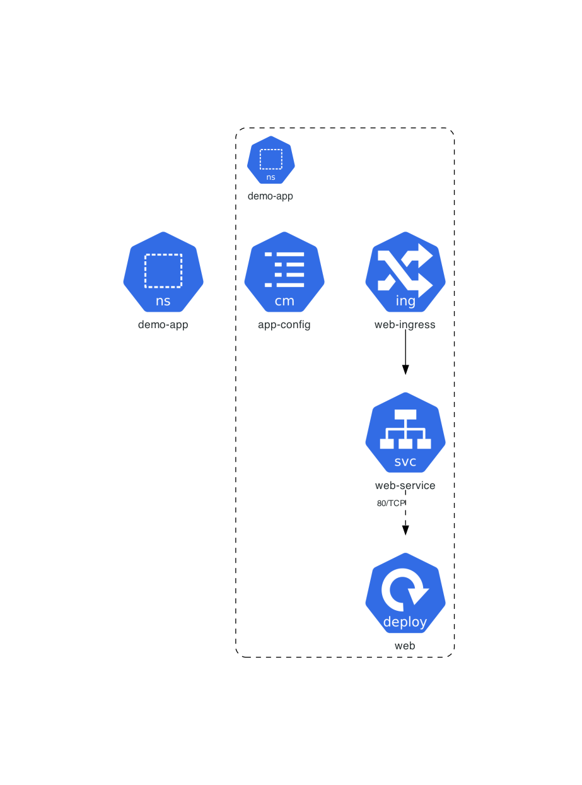

# Kube Diagrams Demo

This project demonstrates how to generate architecture diagrams from standard Kubernetes manifests using [kube-diagrams](https://github.com/philippemerle/KubeDiagrams/tree/main).


## 📦 Prerequisites

- Python 3.7+
- [kube-diagrams](https://github.com/philippemerle/KubeDiagrams/tree/main) installed with pip.

## 🚀 Usage

1. Apply or edit your Kubernetes manifests (example provided in `demo.yaml`).

2. Generate a diagram:

```bash
kube-diagrams -o demo-diagram.png demo.yaml
```

